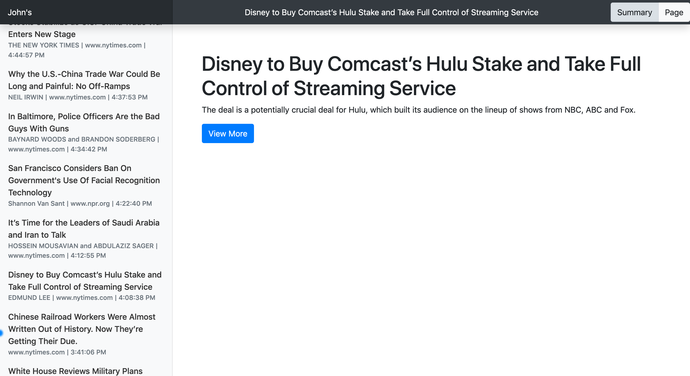

# FeedPage

[](https://travis-ci.org/johnjones4/FeedPage)

[](https://github.com/standard/standard)



FeedPage is a barebones RSS reader designed to focus on page load time and to get out of your way.

## Setup

FeedPage may be run in a container with the following command:

```sh
docker run \
  --env OPML_URL=<URL to an OPML file> \
  --env N_ITEMS=<Number of items to display per category> \
  --env REFRESH_MINUTES=<How oftern to refresh the feed> \
  --env PORT=80 \
  --port 80:80 \
  johnjones4/feedpage
```

## Development

To setup FeedPage for development, run the following:

```bash
git clone git@github.com:johnjones4/FeedPage.git
cd FeedPage
touch .env
```

In the .env file just created, declared the enviroment variables specified under Setup, except for the PORT variable. Then, in that same directory, run:

```bash
npm install
node index.js
```

In a web browser, open: http://localhost:8000.
